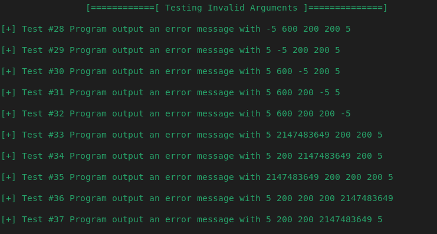
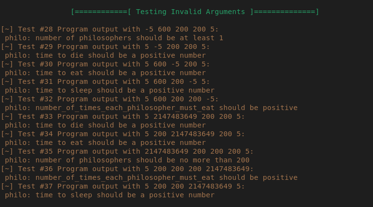

# HubPhi

Pour savoir qu'il y a un dead qqpart
1) soit une variable static dans la fonction qui verifie si un philo est mort ou pas, et qui passe a TRUE des qu'un philo est mort, un autre arrive et voit cette variable deja a TRUE (est-ce tricher)
2) dans la structure generale avoir un dead_flag (int), et dans la structure de chaque philo un dead (int *) - pointeur sur int - qui pointe vers le dead_flag.

https://medium.com/@ruinadd/philosophers-42-guide-the-dining-philosophers-problem-893a24bc0fe2
https://github.com/DeRuina/philosophers/tree/main/src
https://www.codequoi.com/threads-mutex-et-programmation-concurrente-en-c/

https://drvegapunk.notion.site/Philosophers-dc59887c55df41fca09739246a14f0f0

3 610 200 200

valgrind --tool=helgrind
valgrind --tool=drd

PhiloTuto

